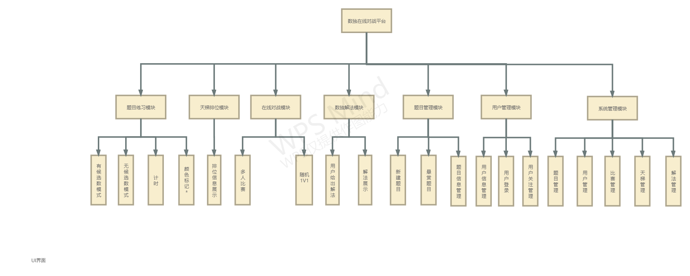

## 项目名

OurSuduku

## 项目类型

基于B/S架构的在线对战网络平台

## 项目背景

​       数独是一款人类有史以来最优秀的一直游戏之一，起源于18世纪的瑞士大数学家欧拉，数独具有规则易懂、解题方法简单、数学内涵深刻等优点。
​       做数独游戏只需要逻辑思维能力，与数字运算无关。虽然玩法简单，但提供的数字却千变万化，所以不少教育者认为数独是锻炼脑筋的好方法。
​       目前市面上大多有关数独的软件或者网站只提供了题目和做题界面，些许网站提供了在线对战平台，但并无公平的竞技性和统一的排名规则，基于此，我们希望通过构建一个公平统一的竞技平台，在这个平台上我们可以练习数独，数独比赛，学习数独等等，数独爱好者可以在这个平台上进行友好的交流。

## 用户调研

### 问卷二维码

### 调研结果

见附件/数独游戏问卷调查.xlsx

## 功能简述

​       整体来说分为6个模块

### 题目练习模块

​       该模块给用户提供一个数独做题界面，主要功能为候选数，计时和颜色标记。

### 数独解法模块

​       该模块给用户提供了一个给出数独解法的论坛，大神级玩家可以在此给出自己的解法，菜鸟级可以在此学习大神级玩家的解法进而进步。

### 天体排位模块

​       该模块通过用户做题题目难度及平均用时进行一个排名，还可以和高位次玩家进行挑战。

### 自由出题模块

​       用户可以通过出题模块出题，还可以出题悬赏，提升别人的同时也提升自己。

### 在线对战模块

​       该模块提供了几种不同形式的比赛模式，多人比赛和1V1，1V1又分为随机和好友，用户可以在比赛中提升自我。

### 管理模块

​       该模块主要为系统管理员，系统管理员可以通过该模块对用户，题目，比赛，排名，解法进行管理。

## 整体架构

| 部分     | 实现                  | 工具                           |
| -------- | --------------------- | ------------------------------ |
| 界面设计 |                       | axure                          |
| 前端     | vue.js                | HBuilder                       |
| 后端     | Springboot            | intellij                       |
| 服务器   | Tomcat                | 阿里云                         |
| DB       | Mysql                 | PowerDesign、Datagrip、Navicat |
| 版本控制 |                       | git                            |
| 代码托管 |                       | github                         |
| 参考     | https://www.oubk.com/ |                                |

## 小组分工

| 人员   | 分工                            |
| ------ | ------------------------------- |
| 刘羽佳 | 项目经理、界面设计、前端开发    |
| 张鑫   | 架构师、DBA、系统管理员、测试员 |
| 潘言   | 开发组长、产品设计、后端开发    |

